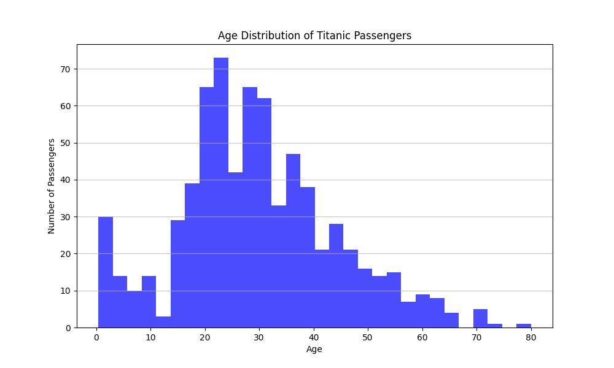

# Welcome
Hello I'm YuChen. This project aims to solve the Text-to-SQL issue by Langgraph new agent framework **Deep Agent**.

## Expected Abilities
1. Flexible Utilization: User only need to ask in natural language and attatch the datasets as input.
2. Automatically Data Schema Analyze: System will read and understand the user query and data schema.
3. Text-to-SQL: Transfer user's query to SQL language.
4. Visualization Present: Present the analysis to answer user's query.

## Present
### Example 1: Dataset Analysis
- Task: `Analyze the count of surviving males over age 20 in the Titanic dataset.`
- Input: `titanic_dataset.csv`
- Response: `在這次的數據分析任務中，您要求分析泰坦尼克號數據集中20歲以上存活男性的數量。根據分析結果，泰坦尼克號數據集中20歲以上的存活男性數量為64人。`
- Planning:
     ```json
     {
          "planning": 
          [
               {
                    "task_index": 1, 
                    "planning_type": "data_analysis", 
                    "question": "Analyze the count of surviving males over age 20 in the Titanic dataset.", 
                    "answer": "The count of surviving males over age 20 in the Titanic dataset is 64.", 
                    "dataset_path": "path to titanic_dataset.csv", 
                    "finish": true
               }
          ]
     }
     ```

### Example 2: Dataset Cleaning
- Task: `Clean the Titanic dataset to make sure there are no missing values and save it for me.`
- Input: `titanic_dataset.csv`
- Response: 
     ```markdown
     在這次計劃中，我們針對泰坦尼克號數據集進行了清理和分析，具體步驟如下：

     1. **檢查缺失值**：
     - 在泰坦尼克號數據集中，發現以下缺失值：
          - **年齡 (Age)**: 177 個缺失值
          - **艙位 (Cabin)**: 687 個缺失值
          - **登船港口 (Embarked)**: 2 個缺失值

     2. **處理缺失值的建議**：
     - 提出了多種處理缺失值的方法，包括：
          - 刪除缺失值的行
          - 使用均值、中位數或眾數進行填補
          - 創建新類別來標記缺失值
          - 使用插值法估算缺失值
          - 標記缺失值的二元列
          - 根據領域知識採用特定方法

     3. **保存清理後的數據集**：
     - 清理後的泰坦尼克號數據集已成功保存，路徑為：`path to titanic_dataset.csv cleaned_titanic_dataset.csv`。

     如需進一步的幫助或示例代碼，請隨時告知！
     ```
- Planning:
     ```json
     {
          "planning":
          [
               {
                    "task_index": 1,
                    "planning_type": "data_analysis",
                    "question": "Check the Titanic dataset for any missing values and provide a summary of the findings.",
                    "answer": "The summary of missing values in the Titanic dataset is as follows:\n\n- **Age**: 177 missing values\n- **Cabin**: 687 missing values\n- **Embarked**: 2 missing values",
                    "dataset_path": "path to titanic_dataset.csv",
                    "finish": true
               },
               {
                    "task_index": 2,
                    "planning_type": "data_analysis",
                    "question": "If there are missing values in the Titanic dataset, suggest appropriate methods for handling them.",
                    "answer": "The Titanic dataset contains several columns with missing values, particularly in the \"Age\", \"Cabin\", and \"Embarked\" columns. Here are some appropriate methods for handling these missing values:\n\n1. **Remove Rows with Missing Values**:\n   - If the number of missing values is small, you can simply remove the rows with missing data.\n\n2. **Imputation**:\n   - **Mean/Median Imputation**: For numerical columns like \"Age\", you can fill missing values with the mean or median of the column.\n   - **Mode Imputation**: For categorical columns like \"Embarked\", you can fill missing values with the mode (most frequent value).\n   - **Predictive Imputation**: Use machine learning models to predict and fill missing values based on other features.\n\n3. **Create a New Category**:\n   - For categorical variables, you can create a new category for missing values (e.g., \"Unknown\" for \"Cabin\" or \"Embarked\").\n\n4. **Use Interpolation**:\n   - For numerical data, you can use interpolation methods to estimate missing values based on other data points.\n\n5. **Flag Missing Values**:\n   - Create a new binary column indicating whether the value was missing, which can be useful for models that can leverage this information.\n\n6. **Domain-Specific Methods**:\n   - Depending on the context, you might have specific methods to handle missing values based on domain knowledge.\n\nWould you like to see a Python code example implementing any of these methods?",
                    "dataset_path": "path to titanic_dataset.csv",
                    "finish": true
               },
               {
                    "task_index": 3,
                    "planning_type": "data_analysis",
                    "question": "After cleaning the dataset, save the cleaned version of the Titanic dataset.",
                    "answer": "The cleaned version of the Titanic dataset has been saved to: `path to cleaned_titanic_dataset.csv`.",
                    "dataset_path": "path to titanic_dataset.csv",
                    "finish": true
               }
          ]

     }
     ```

### Example 3: Dataset Analysis and Visualization
- Task: `Clean the Titanic dataset to make sure there are no missing values and visualize the age and distribution with picture results.`
- Input: `titanic_dataset.csv`
- Response: 
     ```markdown
     在這次計劃中，我們針對泰坦尼克號數據集進行了數據清理和可視化分析。

     1. **數據清理**：
     - 我們清理了泰坦尼克號數據集，以確保沒有缺失值。清理前的缺失值統計如下：
          - 年齡 (Age): 177
          - 船艙 (Cabin): 687
          - 登船港口 (Embarked): 2
     - 清理後的數據集已保存為 `titanic_dataset_cleaned.csv`。

     2. **數據可視化**：
     - 我們成功地可視化了乘客的年齡分佈，並將結果保存為 PNG 文件。該文件的路徑為 `titanic_age_distribution.png`。

     整體來說，計劃已順利完成，數據集已清理並可視化。
     ```
     
- Planning:
     ```json
     {
          "planning":
          [
               {
                    "task_index": 1,
                    "planning_type": "data_analysis",
                    "question": "Clean the Titanic dataset to ensure there are no missing values.",
                    "answer": "The Titanic dataset has been cleaned to remove rows with missing values. Here are the details:\n\n- **Missing values before cleaning:**\n  - Age: 177\n  - Cabin: 687\n  - Embarked: 2\n\nThe cleaned dataset has been saved as `titanic_dataset_cleaned.csv`.",
                    "dataset_path": "path to titanic_dataset.csv",
                    "finish": true
               },
               {
                    "task_index": 2,
                    "planning_type": "data_analysis",
                    "question": "Visualize the age distribution of passengers in the Titanic dataset.",
                    "answer": "The age distribution of passengers in the Titanic dataset has been successfully visualized and saved as a PNG file. You can find the file at the following path:\n\n**titanic_age_distribution.png**  \n`path to titanic_age_distribution.png`",
                    "dataset_path": " path to titanic_dataset.csv",
                    "finish": true
               }
          ]  
     }
     ```


## Architecture
``` plaintext
User Question
     ↓
Intent Agent 
     └─ Check if user's question aligns with the system's capabilities.
     ↓
Planning Agent 
     └─ Orchestrate specialized sub-agents and manage complex, multi-step procedure.
     ↓
Specialized Sub-agents
     ├─  Dataframe Agent
     │    ├─ Helper Tools
     │    │    ├─ execute_python()
     │    ├─ Filesystem Tools (optional)
     │    │    ├─
     │    │    ├─ ls
     │    │    ├─ grep
     │    │    ├─ read_file
     │    │    ├─ write_file
     │    │    └─ edit_file
     └─ Other Specialized Sub-agents ... (waiting)
     ↓
Summary Agent
     ↓
Formatted Answer
```


## Reference
### Reading Reference
- [LangChain - DeepAgents Core Components](https://docs.langchain.com/oss/python/deepagents/harness)
    - Backend Component Settings 
### Datasets Reference
- [Titanic - Machine Learning from Disaster](https://www.kaggle.com/competitions/titanic/data)